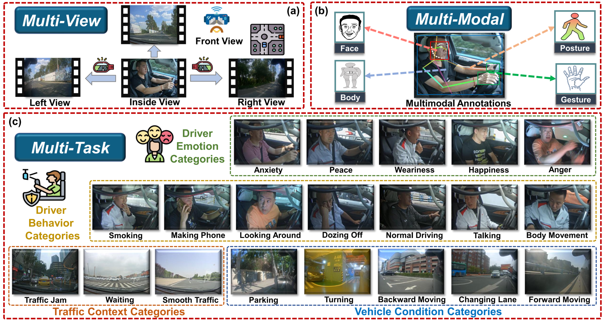
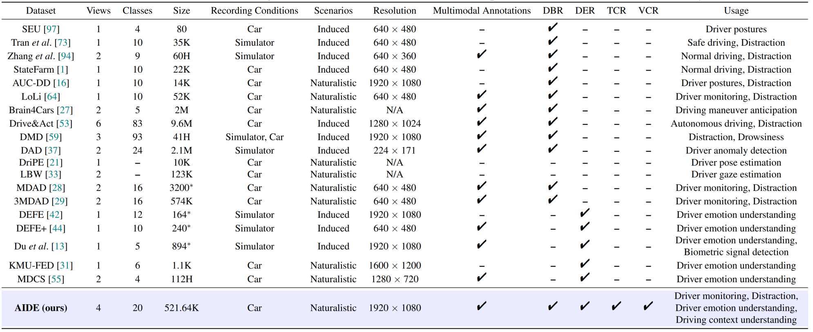
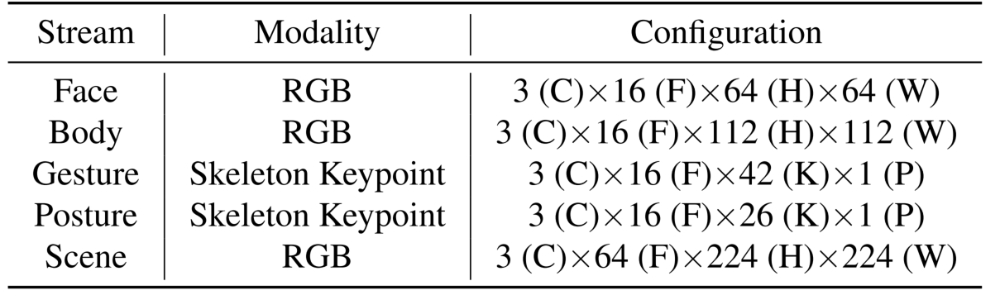

# AIDE: A Vision-Driven Multi-View, Multi-Modal, Multi-Tasking Dataset for Assistive Driving Perception

## Paper

This repository contains available information on the AIDE dataset from the ICCV2023 paper:

[**AIDE: A Vision-Driven Multi-View, Multi-Modal, Multi-Tasking Dataset for Assistive Driving Perception**](https://github.com/ydk122024/AIDE)<br>

Please cite our paper if you find this work useful for your research:

```
@inproceedings{yang2023AIDE,
author    = {Yang, Dingkang},
title     = {AIDE: A Vision-Driven Multi-View, Multi-Modal, Multi-Tasking Dataset for Assistive Driving Perception},
booktitle = {xxxxxxxxxxxxxx},
month     = {June},
year      = {2023},
pages     = {19005--19015}
} 
```

## Abstract

Driver distraction has become a significant cause of severe traffic accidents over the past decade. Despite the growing development of vision-driven driver monitoring systems, the lack of comprehensive perception datasets restricts road safety and traffic security. Here, we present an AssIstive Driving pErception dataset (AIDE) that considers context information both inside and outside the vehicle in naturalistic scenarios. 



AIDE facilitates driver monitoring through three distinctive characteristics：

* **Multi-view**: four distinct camera views provide an expansive perception perspective, including three out-of-vehicle
views to observe the traffic scene context and an in-vehicle
view to record the driver’s state.

* **Multi-modal**: diverse data annotations from the driver support comprehensive perception features, including face, body, posture, and
gesture information.

* **Multi-task**: four pragmatic driving understanding tasks guarantee holistic assistive perception, including driver-centered behavior and emotion recognition, traffic context, and vehicle condition recognition.

## Comparison



We show a specification comparison with the relevant assistive driving perception datasets for the proposed AIDE. Please see the main paper for more details on the citations for the other datasets in the figure.

## User Guide

1. **Dataset Download**

   Researchers should use AIDE only for non-commercial research and educational purposes. The Cloud Drive Link: [coming soon](https://github.com/ydk122024/AIDE).

2. **Configurations**

* AIDE contains 2898 data samples with 521.64K frames. Each sample consists of 3-second video clips from four views, where the durations share a specific label from each perception task. AIDE is randomly divided into training (65%),
validation (15%), and testing (20%) sets without considering held-out subjects due to the naturalistic nature of data imbalance. The partitioned sample paths are stored in `training.csv`, `validation.csv`, and `testing.csv`.
The content format is as follows:

```
AIDE_Dataset/0001/, AIDE_Dataset/annotation/0001.json
```

* The first column of each CSV file stores the path to the initial data, which includes the videos and the sampled frames. For any sample, the data structure is as follows:

```
AIDE_Dataset
├── 0001
│   ├── frontframes
│   │   ├── 0.jpg
│   │   ├── 1.jpg
│   │   ...
│   ├── leftframes
│   │   ├── 0.jpg
│   │   ├── 1.jpg
│   │   ...
│   ├── rightframes
│   │   ├── 0.jpg
│   │   ├── 1.jpg
│   │   ...
│   ├── incarframes
│   │   ├── 0.jpg
│   │   ├── 1.jpg
│   │   ...
│   ├── front.mp4
│   ├── left.mp4
│   ├── right.mp4
│   ├── incar.mp4
...
```
* The second column of each CSV file stores the path to the JSON file of annotations and labels for the corresponding sample. Specifically, each JSON file mainly includes the bounding boxes, Halpe 136 keypoints (from [AlphaPose](https://github.com/MVIG-SJTU/AlphaPose) and post-processing), and the ground truths of the four tasks.
The keypoints are detailed below:

```
//26 body keypoints
    {0,  "Nose"},
    {1,  "LEye"},
    {2,  "REye"},
    {3,  "LEar"},
    {4,  "REar"},
    {5,  "LShoulder"},
    {6,  "RShoulder"},
    {7,  "LElbow"},
    {8,  "RElbow"},
    {9,  "LWrist"},
    {10, "RWrist"},
    {11, "LHip"},
    {12, "RHip"},
    {13, "LKnee"},
    {14, "Rknee"},
    {15, "LAnkle"},
    {16, "RAnkle"},
    {17,  "Head"},
    {18,  "Neck"},
    {19,  "Hip"},
    {20, "LBigToe"},
    {21, "RBigToe"},
    {22, "LSmallToe"},
    {23, "RSmallToe"},
    {24, "LHeel"},
    {25, "RHeel"},
    //face
    {26-93, 68 Face Keypoints}
    //left hand
    {94-114, 21 Left Hand Keypoints}
    //right hand
    {115-135, 21 Right Hand Keypoints}
```
Despite the face keypoints, we have not adopted them in the current version of the paper.

* The basic data loading and processing procedures are provided in `dataset.py`. The detailed input configurations for the different streams in each sample are as follows:

<p align="center">


